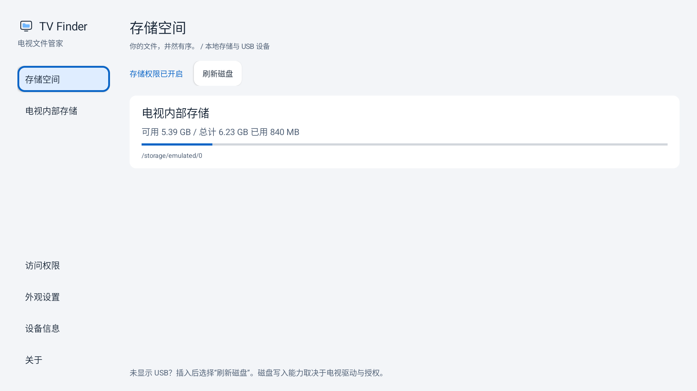
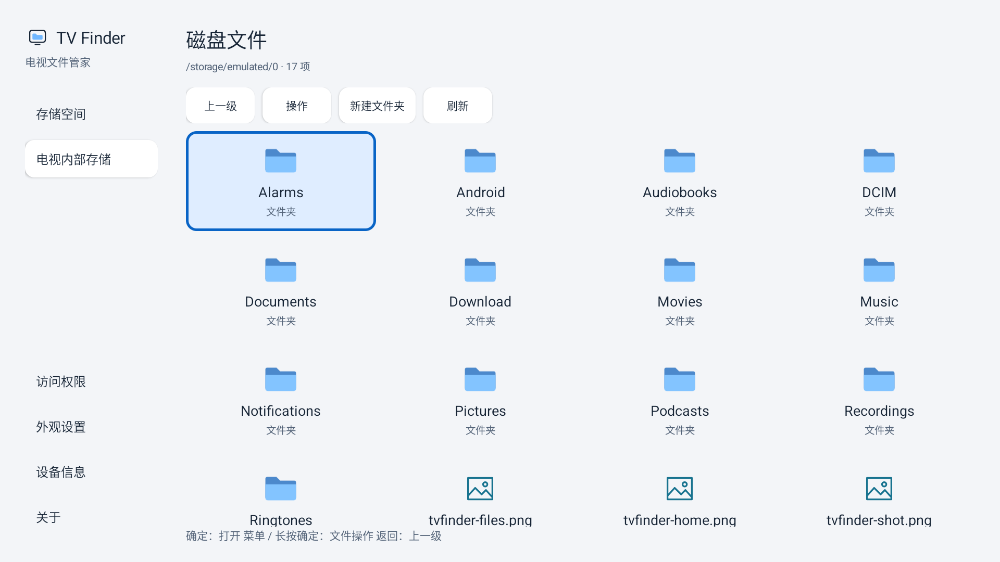

# 电视文件管家

[English](README.en.md) | [本地库编译指南](docs/本地库编译指南.md) | [版本说明](docs/版本说明.md) | [第三方声明](docs/第三方声明.md) | [Apache-2.0](LICENSE)


面向当前海信电视（系统报告型号 `VIDAA_TV`、设备代号 `MT9653`）的本地文件管理 Android 应用。用户提供的产品系列为 E5Q，具体商品型号尚未由电视系统信息确认。应用采用适合遥控器的侧栏导航、四列文件网格、大字体和高对比焦点，布局参考电视文件浏览器的使用习惯，未复制 ES 的商标或图片资产。

- 作者：**liaojinlong**。
- 项目：[JinlongLiao/TvFinder](https://github.com/JinlongLiao/TvFinder)。SSH 地址：`git@github.com:JinlongLiao/TvFinder.git`。
- 包名：`io.github.jnlongliao.tv.finder`，按作者指定拼写，与 GitHub 用户名大小写无绑定要求。
- 当前版本：**0.1.0**，个人试用预览版；内建预览与遥控器操作已在当前电视上用测试文件验收，完整格式兼容性仍待验收。
- 开源协议：**Apache-2.0**，详见 [LICENSE](LICENSE) 和 [NOTICE](NOTICE)。第三方依赖保留各自的归属与许可。

## 界面与语言





中文、英文默认跟随系统，也可在“关于 → 语言 / Language”选择简体中文或 English。语言切换保留当前目录与待粘贴项；文件操作过程中不可切换。未提供翻译的系统语言回退英文。文件名与用户数据不会翻译或改名。

图标区分安装包（APK / EXE / RPM / DEB 等）、Word、Excel、PPT、PDF、文本、音频、视频、图片、压缩包、源代码、字幕、电子书、磁盘镜像等；扩展名大小写不敏感，未知类型显示普通文件。**识别 EXE / RPM 不表示 Android 可以运行 Windows / Linux 程序。**

## 外观主题

侧栏“外观设置 → 主题”提供 **浅色、深色、跟随系统**，首次安装默认浅色，选择会持久保存。主题覆盖首页、文件网格、按钮、焦点、输入框和弹窗；切换后保留目录及待粘贴项。跟随系统模式读取电视实际的明暗配置，系统不提供夜间标志时显示浅色；固定模式不随电视设置变化。系统主题在文件任务中变化时，任务结束后再重建界面；操作失败时先显示错误，关闭提示后再应用。

## 安装与使用

1. 本次预览功能请安装新构建的 `app/build/outputs/apk/debug/app-debug.apk`。`交付/电视文件管家-0.1.0-release.apk` 是此前的 Release 构建，不包含本次尚未重新发布的预览改动；两者签名不同，不能直接相互覆盖。APK 和私钥不提交 Git。
2. 在电视应用列表打开“电视文件管家”，选择“开启文件访问权限”，按系统页面授权。
3. 选择电视内部存储或系统已挂载的 USB 磁盘。若 exFAT U 盘未被电视挂载，选择侧栏显示的 U 盘设备名称，并同意 Android 的 USB 设备授权弹窗。
4. 在文件列表用方向键移动焦点，确定键打开文件夹或进入文件预览，返回键回到上一级。
5. 菜单键、长按确定键或顶部“操作”按钮打开复制、移动、重命名、删除和详细信息菜单。
6. 复制或移动后进入目标目录，选择“粘贴”。操作前显示源和目标，避免选错磁盘。

通过 USB 直连的文件会先复制为有界的应用缓存副本，再进入同一个预览页；缓存副本在退出后清理。该页面支持卷内新建目录、复制、移动、重命名、删除，以及通过本应用内部文件浏览页导入单个文件。不支持 NAS/SMB；不申请网络权限。

## 文件预览与遥控器

文件列表按确定键进入应用内预览，电视上即使没有兼容的外部应用也能查看常见文件。预览区适配应用的浅色、深色和跟随系统主题，图片、PDF 与视频尽量利用电视画面；纯音频显示主题色信息面板。

| 按键 | 预览页作用 |
| --- | --- |
| 上 / 下 | 切换当前目录中前一 / 后一份可预览文件，跨文档、音频、视频、PDF、图片和文本可连续浏览；首尾不循环。 |
| 左 / 右 | PDF 翻上一 / 下一页；Office 与普通文本翻上一 / 下一屏；音视频后退 / 前进 10 秒。 |
| 确定、播放 / 暂停 | 音视频播放或暂停；确定键聚焦在具体按钮时执行该按钮动作。 |
| 菜单 | 选择电视上能处理该文件类型的其他应用；若没有兼容应用，系统可能仍显示空选择器。 |
| 返回 | 退出预览，回到原文件列表。 |

内建预览支持常见图片、PDF、系统解码器可播放的音视频、UTF-8 文本，以及 `docx/docm`、`xlsx/xlsm`、`pptx/pptm/ppsx` 的**有限纯文字提取**。Office 预览不还原排版、公式、表格样式和嵌入媒体；其中的“屏数”按电视可视高度计算，不是原文档页码。传统二进制 `doc/xls/ppt` 等格式需要电视上已安装的兼容应用，例如能处理对应格式的 WPS 版本。能否用外部应用打开还取决于电视固件的应用解析能力。

USB 直连预览和上下切换使用临时副本，单文件上限为 1 GiB；较大的文件、空间不足或拔盘时会提示失败并保留当前预览。选择其他应用时，会向系统报告能处理该文件的候选应用临时显式授予这一文件的只读权限，返回或预览页销毁时撤销这些显式授权。应用仅将受支持的普通文件纳入上下切换顺序，不执行 APK、EXE 等文件。

## 文件与权限边界

- 最低 Android 11（API 30），使用系统“管理所有文件”授权。
- “内部存储”指用户共享存储，不等同于整台电视的所有系统文件。其他应用的私有目录以及受系统保护的目录不能保证访问。
- 磁盘容量显示文件系统提供的总量、可用量和二者差值，不等于商品标注的闪存容量，也没有把差值全部解释为可清理文件。
- 普通 USB 入口使用系统存储卷 API 和可读的 `/storage` 挂载目录。以设备名称显示的 USB 直连入口另经 Android USB Host 权限访问兼容的 USB Mass Storage 设备，不要求电视内核挂载 exFAT；不会让其他应用或电视系统获得 exFAT 挂载。该直连路径目前不支持 NTFS。
- USB 直连支持 SCSI Bulk-Only、512/4096 字节逻辑扇区以及 READ/WRITE(10) 地址范围。多分区设备、特殊 USB 桥接器、断电和大文件尚未完整验收。同卷移动使用重命名；跨电视存储通过单文件导入/导出完成，不提供跨存储卷文件夹一次性移动。
- 默认仍进入存储空间首页；侧栏“系统根目录”可进入 `/`。目录页提供大号可聚焦面包屑，可直接跳转到任意祖先目录。系统根入口不会绕过 Android、SELinux 或只读挂载限制。
- 同名目标直接报错，不自动覆盖或合并目录。重命名可以保留中文名称；拒绝空名称、路径穿越及常见文件系统不允许的字符。
- 复制失败或取消会尝试删除本次新建的目标残留；清理失败会显示路径。突然断电、杀进程或拔盘不能保证清理完成，需要检查目标。
- 移动按“复制全部数据 → 比对内容 → 删除源”执行，会额外读取源和目标。空间不足时失败，不自动腾出空间。源删除阶段不可取消；若此阶段失败，目标保留，源可能部分删除。
- 文件操作不是跨应用事务。执行中请勿通过其他应用修改同一源文件或目标目录，也不要拔盘。
- 删除为永久删除，无回收站；确认框默认焦点在“取消”。中途取消不会恢复已经删除的文件。
- 文件操作日志记录动作、路径和完整异常，不记录文件正文；日志通过 Android logcat 获取。

## 当前电视系统信息

通过已配对电视的 ADB `getprop` 于 2026-09-24 核对：

| 项目 | 电视报告值 |
| --- | --- |
| 品牌 / 制造商 | `Hisense` / `Hisense` |
| 系统型号 | `VIDAA_TV` |
| 设备代号 | `MT9653` |
| Android 版本 / API | `11` / `30` |
| 系统构建标识 | `RP1A.200720.011 release-keys` |
| Android 安全补丁级别 | `2022-09-05` |

这些是当前电视固件报告的值；`VIDAA_TV` 不是已核实的零售商品型号。用户提供的 E5Q 系列信息不用于推断屏幕尺寸、内存容量或“U8 系统”版本，应用也不按商品名称硬编码权限或挂载路径。

安装后可在侧栏“设备信息”查看实际厂商、型号、Android 版本、API 级别、CPU 架构、固件标识和授权状态，无需依赖电视设置页。

## 能否成为默认文件管理器

本版是独立文件管理应用，未实现 `ACTION_GET_CONTENT` 文件选择处理器或 `DocumentsProvider`，没有声称可以成为全局默认文件管理器。

Android 的 `SYSTEM_DOCUMENT_MANAGER` 是系统角色，仅允许电视厂商向系统应用授予；普通安装的 APK 不能通过权限申请成为系统默认文档管理器。标准存储访问框架由系统文件选择界面汇集文件提供者。将来增加 `DocumentsProvider` 可以在有文件选择界面的设备中提供文件来源，但不会替换系统界面。这台电视此前调用系统文件选择器失败，因此该集成在当前固件上不能保证可用。插入 U 盘后的系统弹窗和 NAS 提示也不由本应用控制。

“管理所有文件”权限控制可访问的文件范围，不授予替换系统文档管理器的权限。安装应用、改包名、授权存储，都不会自动改变电视默认文件管理器。

参考：[Android 系统角色](https://source.android.com/docs/core/permissions/android-roles)（`SYSTEM_DOCUMENT_MANAGER`）和 [DocumentsProvider](https://developer.android.com/reference/android/provider/DocumentsProvider)。

## 构建

使用 JDK 17、Android SDK 34、Gradle Wrapper 8.9、Android Gradle Plugin 8.5.2。项目在 `app/build.gradle` 固定 NDK `21.4.7075529` 和 CMake `3.22.1`，由 Gradle 编译随仓库提供的 FatFs C 源码；不依赖本机硬编码路径或单独的 Rust 工具链。设置 `ANDROID_HOME` 或在本机 `local.properties` 配置 `sdk.dir`，接受 Android SDK 许可证，允许联网下载缺失组件。

Windows PowerShell：

```powershell
.\gradlew.bat :app:assembleDebug
```

macOS / Linux：

```bash
bash ./gradlew :app:assembleDebug
```

Debug APK 位于 `app/build/outputs/apk/debug/app-debug.apk`；Debug 和 Release 均使用 `io.github.jnlongliao.tv.finder` 包名，已移除临时排障探针。Release 签名仅从本机被忽略的 `.signing/release.properties` 读取；未提供密钥的电脑仍可编译 debug 包，Release 则生成未签名 APK。各电脑的 debug 签名可能不同，更新已安装包前须核对包名与签名。详细环境准备、本地库源码、ABI、签名、校验与排错见 [本地库编译指南](docs/本地库编译指南.md)。Windows 本机编译已通过；macOS、Linux 未在本次会话中实际构建。

源码采用 Android 字符串资源管理界面和应用错误提示；文件操作按枚举分派，避免语言切换影响业务行为。版本号由 `app/build.gradle` 提供，关于页读取生成的 `BuildConfig`。内置版本说明和许可在构建时从 `docs/`、`LICENSE`、`NOTICE` 同步，避免文档与应用显示不一致。

当前环境没有可复用的指定 `com.wlzn.common.util` 工具源码，工程也没有这项依赖；文件操作采用 Android 提供的 `java.nio.file`、Java 标准流与 `Objects`，没有另引重叠的第三方工具库，也没有新增自定义业务异常。

## 实机验收建议

2026-09-24 在已配对的海信 Android 11 电视和 aigo exFAT U 盘上，已通过独立调试包验证 USB 直连读取目录，以及独立测试目录内创建、写入回读、重命名、复制和删除；测试目录已清理。本次新的 Debug 包还验证了内置存储文件连续预览、PDF 遥控器翻页、音视频左右键 10 秒跳转，以及 USB 测试 MP3 向测试 MP4 的下键切换；两份 USB 测试媒体已删除。详细结果见 [预览功能实机验证](交付/预览功能实机验证.md)。此前 Release 包的本次改动尚未重新构建验收。普通用户文件、4 GiB 以上文件、空间不足、拔插、待机和跨平台构建也仍待验收。

如果磁盘未识别或只读，请记录“设备信息”、USB 文件系统类型及错误提示。模拟器成功不代表海信驱动行为相同。

## 官方参考

- [Android TV 应用入口](https://developer.android.com/training/tv/get-started/create)
- [遥控器导航](https://developer.android.com/training/tv/get-started/navigation)
- [管理所有文件权限及限制](https://developer.android.com/training/data-storage/manage-all-files)
- [存储卷 API](https://developer.android.com/reference/android/os/storage/StorageVolume)
- [系统存储访问框架与文件选择器](https://developer.android.com/guide/topics/providers/document-provider)
- [AGP 8.5 构建兼容要求](https://developer.android.com/build/releases/agp-8-5-0-release-notes)
